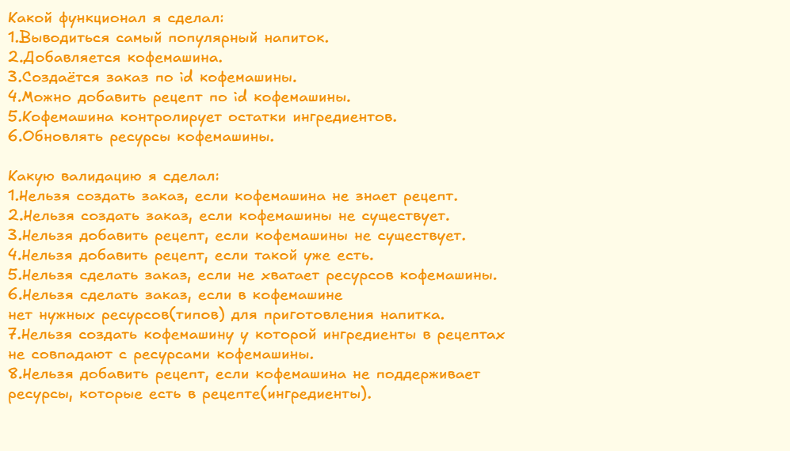

Кофемашина(ДЛЯ ТЕСТИРОВАНИЯ НЕОБХОДИМО СОЗДАТЬ КОФЕМАШИНУ)
Необходимо разработать ПО для работы кофемашины и ее управления через API.
Функциональные требования:
- Кофемашина умеет готовить 3 стандартных напитка:
  - эспрессо
  - американо
  - капучино
- [x] Кофемашина умеет контролировать кол-во и остатки ингридиентов
- [x] Кофемашина умеет запоминать новые рецепты
- [x] Кофемашина собирает статистику и знает самый популярный напиток

Нефункциональные требования:
- кофе заказывают 30 в час
- статистика хранится 5 лет

Требования к технологиям:
- web-сервис на SpringFramework или SpringBoot.
- java не выше 17
- сборщик Maven
- БД PostgresSQL (можно другую с обоснованием)
- Применить FlyWay
- Для тестирования API подключить SwaggerUI

